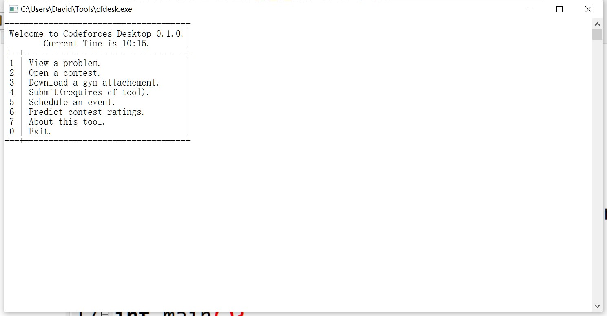

# Codeforces Desktop(cfdesk):A Tool for [Codeforces](https://codeforces.com)

Predict ratings,download [gym](https://codeforces.com/gyms) statements,open contests...All in one!

The files in `bin\` folder are already compiled.You can use them.

To build yourself,simply run build.bat(Requires Visual Studio).

If you don't have Visual Studio,change line 18 of build.bat to `goto buildgcc`.Then the GCC compiler will be used.

Screen shot:

